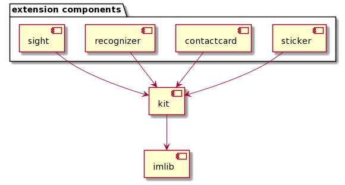

### android-ui-sdk-set

本项目是融云 IM UI SDK 集合，包含了各种 UI 组件。

#### 组件功能介绍

| 组件名称    | 主要功能                                                     |
| ----------- | ------------------------------------------------------------ |
| kit         | IM UI 组件，包含会话列表、聊天窗口、消息内容展示等页面       |
| sight       | 小视频组件，提供了小视频的录制和播放能力                     |
| contactcard | 名片组件，提供了从通讯录选择联系人以名片形式发送给其它人的能力 |
| rcsticker   | 表情组件，提供了一套融云自定义表情                           |
| recognizer  | 语音输入组件，用来将语音转换成文字                           |

#### 依赖关系

外围组件 sight、 recognizer、contactcard、sticker 本地依赖 kit 模块.

kit 模块通过 maven 远程依赖融云核心通信组件 imlib

#### 使用说明

1. 根据业务需要选择以上任意组件本地导入到工程，在应用模块添加对导入模块的依赖即可。

2. 使用外围组件时必须同时导入 kit 模块。

#### 使用建议

1. 强烈不建议直接修改源码内容，防止后续源码升级将修改内容覆盖

2. 建议通过继承重写某些类与自身逻辑不一致的方法，来增加新方法以扩展自身的业务逻辑

3. 如果需要修改资源文件，建议将 SDK 里的资源文件拷贝到应用特定目录下，在 gradle 里配置优先使用特定目录下的资源文件即可。

4. 建议使用 SDK 对外暴露的接口，如果调用私有接口可能会出现版本升级引起私有接口变更

